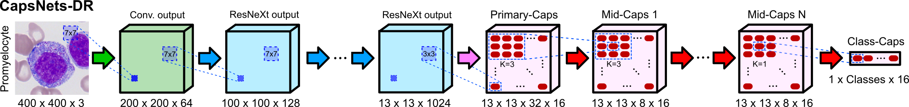
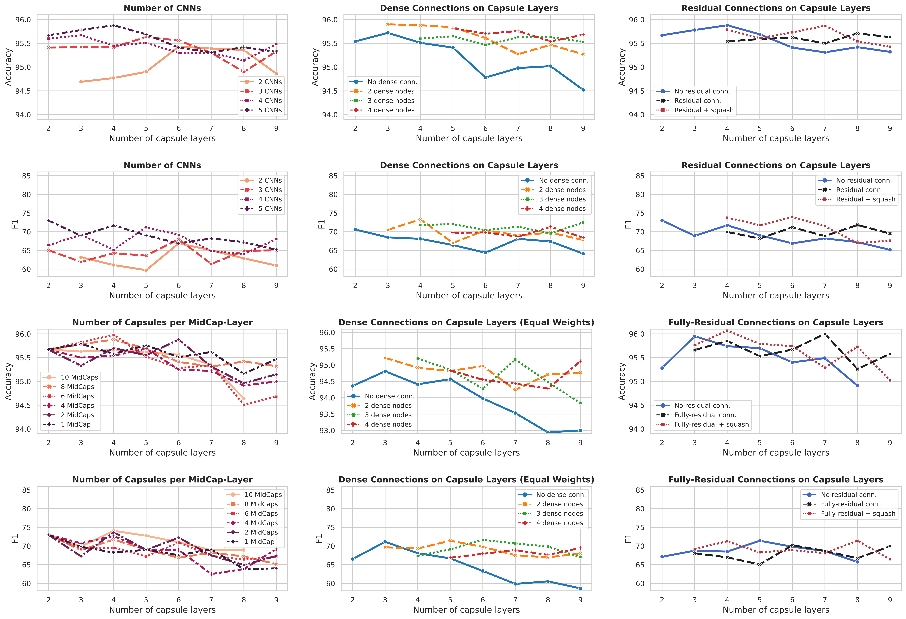

[](https://opensource.org/licenses/Apache-2.0)
[](https://arxiv.org/abs/2108.02644)


# Deep Convolutional Capsules with Dynamic-Routing (ConvCaps-DR)
#### by Juan P. Vigueras-Guillén et al. (https://www.researchgate.net/profile/Juan-Vigueras-Guillen) 

The paper will be available soon.
A previous paper, which explores some of the possibilities of CapsNets, can be found here: https://arxiv.org/abs/2108.02644

&nbsp;

## Introduction
Capsule Networks (CapsNets) is a machine learning architecture proposed to overcome some of the shortcomings of convolutional neural networks (CNNs). The original architecture by [Sabour et al.](https://arxiv.org/abs/1710.09829), which uses a dynamic routing (DR) algorithm, and the following variation by [Hinton et al.](https://openreview.net/pdf?id=HJWLfGWRb), which uses a expectation-maximation (EM) algorithm, have shown good results for digit recognition and small image classification. However, the implementation of Capsnets for the classification of large images has had limited success, particularly for large histopathology images. Furthermore, CapsNets have shown convergence problems when the depth of the capsule section is increased. Our work presents an updated version of CapsNets-DR with several small changes, which provided more stable networks, being possible to increase the depth of the capsule section (up to 9 layers in our experiments). This allowed us to explore the use of residual and dense connections within the capsule section and also the relevance of the number of CNNs before the capsule section. We tested these networks in two public dataset of leukocytes: a set of binary classes (malignant or bening cells, named Leukocyte2, size 450 x 450 px), a set of 15 highly unbalanced classes of leukocytes (named Leukocyte15, size 400 x 400 px). 

&nbsp;

## Network Overview 

The default network has 5 CNNs: one simple convolutional block followed by 4 ResNeXt blocks (in each block, the number of feature maps are doubled and the size is halved (strides=2)). The output is then sent to the Primary-Caps layer, which forms the initial capsules (32 capsules). From that point, the features (in the form of capsules) are introduced to a sequence of mid-capsules (8 capsules), maintaining the spatial information (strides=1). At the end of the network, a capsule layer named "class-cap" provides the results for the different classes. In all capsule layers, the capsules have a size of 16 elements.


<p align="center">

</p>
<p align="center">
<b>Fig. 1 </b> - Default network.
</p>

&nbsp;


## Getting Started Guide

### Install Required Packages
This repo of code is written for Keras using the TensorFlow backend (ver. 2.4.1). Please install all required packages before using this code.
```bash
pip install -r requirements.txt
```

The packages are:
```
tensorflow-gpu==2.4.1
numpy==1.19.5
scikit-learn==0.23.2
scikit-image==0.17.2
matplotlib==3.3.4
opencv==4.5.5
seaborn==0.11.1
pandas==1.0.1
openpyxl==3.0.6
xlrd==1.2.0
```

### How to run the code

From the main files (the different *main_xxx.py*), the user can train and test various networks: set the arguments ```--train``` and ```--test``` to 0 or 1 to turn these off or on respectively. The user needs to modify the code to indicate the type of network and its parameters (see next section). It is necessary to introduce the paths to the data folder and the saving folder as arguments (or modify the main file if prefered). If the network weights are introduced as argument, the program will look for them in the saving folder (modify the code if prefered). 


### Code details

The user should manually change the type of network to use (within the <em>xxx_main.py</em> file), calling the desired network-function. The available networks can be found in the files <em>networks_xxx.py</em>, which access the Capsule functions (in <em>convcaps_dr.py</em> or <em>convcaps_em.py</em>) and the CNN functions (<em>cnn_blocks.py</em>). Moreover, the user should manually modify the parameters of the capsule section (number of capsules, size of the capsules, strides and window of the convolutional capsules, iteration of the routing algorithm, ...) within the <em>xxx_main.py</em> file too (note that the parameters of the CNN section are set in the network-functions as these remained the same in the majority of the experiments). The types of networks are:
* <b>Type of routing</b>: This repository contains the Dynamic Routing (DR) and the Expectation-Maximization (EM) algorithms. However, the experiments were done with the DR algorithm since it provided slightly better results.
* <b>Type of connections within the Capsule section</b>: Default CapsNet, CapsNets with dense connections, and Capsnets with residual connections.
* <b>Parallel CapsNets</b> (from paper https://arxiv.org/abs/2108.02644): These networks branch the CNN section such that it creates several branches ending with a single Mid-Cap, which are then concatenated to route it to the final class-layer. These can be found in the files with the word <em>parallel</em> in it.


### Experiments

For all experiments, we tested several networks with different number of capsule layers (from 2 layers [only Primary- and Class-capsule layers] to 9 layers [7 mid-capsule layers]). Below, we depict the results for the Leukocyte15 dataset, which was divided in 5 folds, using 4 folds for training and 1 for testing. The evaluation metrics were Accuracy and F1. Due to the high-unbalance between classes, F1 describes better how the network handle such unbalance. The default network is as depicted in Fig. 1, with 5 CNNs, 32 Prim-Caps, and 8 capsules in the Mid-Cap layers (the number of Mid-Caps layers is evaluated in all experiments (x-axis in Fig. 2)), being the capsules of size 16. 

The experiments were:

1. <b>Number of CNNs</b>: We evaluated whether reducing the number of CNNs would be benefitial. To this end, we increased the strides to 2 in a capsule layer for each CNN that is removed. We tested networks containing from 2 CNNs to 5 CNNs.
2. <b>Number of Capsules per Mid-Capsule layer</b>: For the default 5-CNNs network, we evaluated whether the number of mid-capsules would be relevant. For this, we set the same number of capsules for all mid-caps layers.
3. <b>Dense Connections</b>: To make these experiments computationally feasible, we reduced the size of the default 5-CNNs network: 24 Prim-Caps and 4 Mid-Caps. Then, we added dense connections within the capsule section. Specifically, we evaluted different sizes of the dense connections, where a "N-dense-connection" means that a capsule layer receives the features of the N previous capsule layers. For instance, for a 2-dense connections in a 4-capsule-layer network (Prim-, Mid1, Mid2, and Class layers), the Mid2 will have as input the features of Prim and Mid1, and Class will have the input of Mid1 and Mid2. If it were a 3-dense connections, only the Class layer will have as input a dense connection with the features of Prim, Mid1, and Mid2. Two variations were evaluated:
    * We add the dense connections to the default network without changing the number of capsules. This would increase the weights: the larger the dense connection, the larger the number of weights.
    * We try to have a similar amount of weights for all the networks. For this, we increase the number of Primary Caps and Mid-Caps for the networks with shorter dense connections (or no dense connections at all) such that they all have approximately 4.5M parameters.
4. <b>Residual Connections</b>: 
    * For the default 5-CNNs network, we add residual connections in the Mid-Cap section. This entails to have the first residual connection after the 2nd capsule layer. Therefore, it is necessary to have a 4-cap-layer network to have a residual connection.
    * Fully-Residual: We modify the network such that it has 10 capsules in the Prim-cap layer and all the Mid-cap layers. Considering that the CNN-section is made of ResNeXt blocks, this allows to add residual connections in between all blocks, creating a fully-residual network.
    * In both cases, we evaluate whether adding a squash function after the residual connection is benefitial.


### Results on the dataset Leukocyte15

The results indicated the following: 

* A larger CNN-section with a shorter Cap-section yields better results than reducing the CNN-section while adding strides to the Cap-section. This contradicts the assumptions made in the original Cap-nets papers, where (i) they suggested to add only one or two CNNs in the beginning of the network so that the capsule section receives simpler features, and (ii) they suggested that deeper capsule sections would help to encode more complex entities in the image. 
* The number of mid-Caps is not very relevant. In fact, the network with only 1 capsule in all Mid-Caps yields similar performance than bigger networks with 10 Mid-Caps. This highlights how powerful capsules can be, where having a single type of capsule in several consecutive layers is enough to later discern between the classes.
* The use of dense connections is clearly beneficial. In fact, the "2-dense-connections" network clearly outperform the non-dense network with just a small increase in weights (no need to create larger dense connections, whose number of weights increases substantially). Also, we obseved certain stability in F1 as the depth of the network is increased, whereas the default network with no dense connections has a decrease in F1.
* The use of residual connections also provides a slight improvement in performance. 

&nbsp;

<p align="center">

</p>
<p align="center">
<b>Fig. 2 </b> - Accuracy and F1 for networks with different number of capsule layers based on: <b>(left column)</b> different number of CNNs before the capsule section and different number of capsules within each mid-Capsule; <b>(middle column)</b> different depth of the dense connections by simply adding the dense connections to the baseline networks or by also adding more number of capsules in smaller networks to have a similar number of weights in all networks [equal weights]; and <b>(right column)</b> the use of residual connections, with and without squashing after the residual addition.
</p>

&nbsp;


## Citation

If you use significant portions of our code or ideas from our paper in your research, please cite our work. 

```
@inproceedings{vigueras2021parallelcaps,
  author    = "Vigueras-Guillén, Juan P. and Patra, Arijit and Engkvist, Ola and Seeliger, Frank",
  title     = "Parallel capsule networks for classification of white blood cells",
  booktitle = "Medical Image Computing and Computer Assisted Intervention - MICCAI 2021",
  series    = "Lecture Notes in Computer Science",
  volume    = "12907",
  pages     = "pp 743--752",
  publisher = "Springer, Cham",
  year      = 2021
}
```

The publication for the specific work in this repository will be made available soon.


### Questions or Comments

Please direct any questions or comments to me; I am happy to help in any way I can. You can email me directly at J.P.ViguerasGuillen@gmail.com


